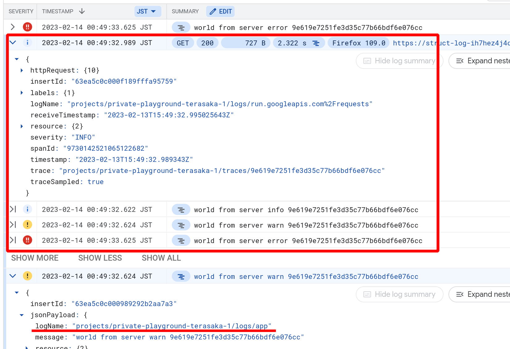

# Google Cloud Loggingとの統合
- `@google-cloud/logging`を利用して
- stdoutにStructured Loggingすることで
- Cloud Loggingにログレベルの反映やログのリクエストごとのグルーピングを行います
  - `severity: ERROR`や
  - `trace: projects/{{projectId}}/traces/{{trace}}`などの反映です



## コールドスタート
確実にログを統合させるために、初期化が完了するまでNuxt(Nitro/h3)でのリクエストの処理を止めてawaitで初期化を待ちます。

## GOOGLE_CLOUD_PROJECT
- プロジェクトIDを取得するために（`@google-cloud/logging`が）必要に応じてmetadataサーバーへの問い合わせを行うことがあります。
  - `google-auth-library` `GoogleAuth.getProjectId()`
- 環境変数 `GOOGLE_CLOUD_PROJECT` をセットすることでこの問い合わせを省略することができるので、初期化が高速化されます。

Google関係のライブラリではしばしば同様の振る舞いがあったりプロジェクトIDが必要になることがあるので、環境変数`GOOGLE_CLOUD_PROJECT`を提供しておくことをおすすめします。


## Usage
Nuxtのモジュールとして独立して実装させています。

今のところ設定項目はありません。

ログ名(`logName`)は`app`です（ハードコードしています）。

```bash
npm install --save-dev @google-cloud/logging
```

```typescript
export default defineNuxtConfig({
  modules: [
    './modules/gcp-log/module',
  ],
});
```
